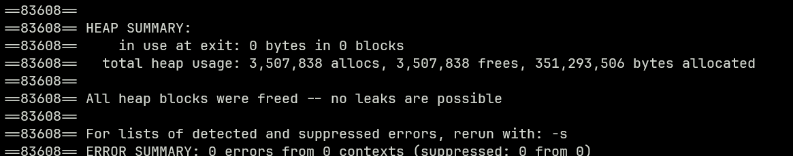

# Spektral::Logger 2  Change Log

## v0.0.1

### Updates
- Resolved memory leak issue in v0.0.0

### Migration Guide
- Users who have implemented custom solutions to address leaks can now remove them.

## v0.0.0
> [!IMPORTANT]
> DO NOT USE `FrontEnd.hpp` yet.

- Defined and Implemented Logger Class, LogEvent, and basic Message/Source types.
- Currently, there is a memory leak, so this project is not yet stable for use.
